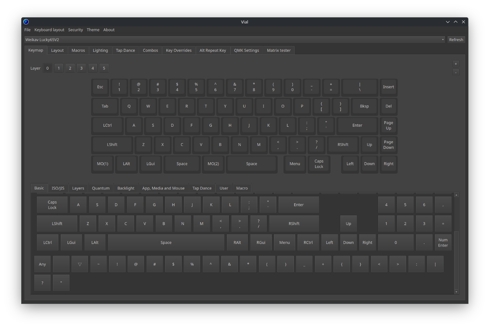

# lucky65v2_vial

1. Clone the entire contents of this repository.

2. Place these files into the keyboard directory of your QMK installation (ensure you're on the vial branch).

3. From the QMK root directory, run `make weikav/lucky65v2:vial`.

Bluetooth is working normally.